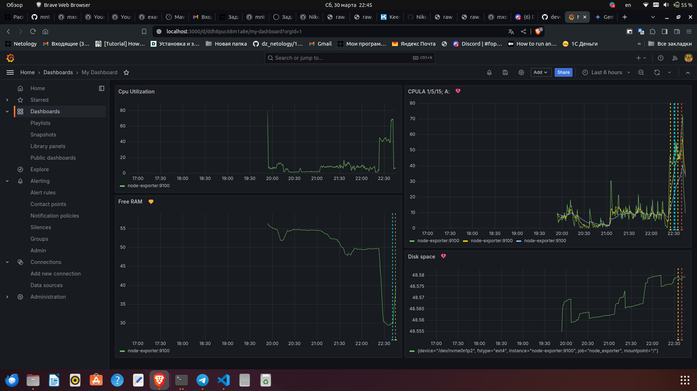

# Никоноров Денис - FOPS-8

# Домашнее задание к занятию 14 «Средство визуализации Grafana»

## Задание повышенной сложности

**При решении задания 1** не используйте директорию [help](./help) для сборки проекта. Самостоятельно разверните grafana, где в роли источника данных будет выступать prometheus, а сборщиком данных будет node-exporter:

- grafana;
- prometheus-server;
- prometheus node-exporter.

За дополнительными материалами можете обратиться в официальную документацию grafana и prometheus.

В решении к домашнему заданию также приведите все конфигурации, скрипты, манифесты, которые вы 
использовали в процессе решения задания.

---
Ответ. Не была использована директория [help]() из репозитория с домашним зааннием написан свой `docker-compose.yml` и `prometheus.yml`

Файлы в папке [Docker](/docker)

**При решении задания 3** вы должны самостоятельно завести удобный для вас канал нотификации, например, Telegram или email, и отправить туда тестовые события.

В решении приведите скриншоты тестовых событий из каналов нотификаций.

## Обязательные задания

### Задание 1

1. Используя директорию [help](./help) внутри этого домашнего задания, запустите связку prometheus-grafana. 

`(Был использовани свой docker-compose.yml)`

1. Зайдите в веб-интерфейс grafana, используя авторизационные данные, указанные в манифесте docker-compose.
1. Подключите поднятый вами prometheus, как источник данных.
1. Решение домашнего задания — скриншот веб-интерфейса grafana со списком подключенных Datasource.


## Задание 2

Изучите самостоятельно ресурсы:

1. [PromQL tutorial for beginners and humans](https://valyala.medium.com/promql-tutorial-for-beginners-9ab455142085).
1. [Understanding Machine CPU usage](https://www.robustperception.io/understanding-machine-cpu-usage).
1. [Introduction to PromQL, the Prometheus query language](https://grafana.com/blog/2020/02/04/introduction-to-promql-the-prometheus-query-language/).

Создайте Dashboard и в ней создайте Panels:

- утилизация CPU для nodeexporter (в процентах, 100-idle);

<details>
	<summary>CPU Utilization</summary>

```PromQL
100 - (avg by(instance) (rate(node_cpu_seconds_total{mode="idle", instance=~"node-exporter:9100"}[1m])) * 100)
```

</details>


- CPULA 1/5/15;

<details>
	<summary>CPULA 1</summary>

```PromQL
(avg by(instance) (node_load1{instance=~"node-exporter:9100"}) * 100) / count by(instance) (count by(cpu, instance) (node_cpu_seconds_total{instance=~"node-exporter:9100"}))
```

</details>

<details>
	<summary>CPULA 5</summary>

```PromQL
(avg by(instance) (node_load5{instance=~"node-exporter:9100"}) * 100) / count by(instance) (count by(cpu, instance) (node_cpu_seconds_total{instance=~"node-exporter:9100"}))
```

</details>

<details>
	<summary>CPULA 15</summary>

```PromQL
(avg by(instance) (node_load15{instance=~"node-exporter:9100"}) * 100) / count by(instance) (count by(cpu, instance) (node_cpu_seconds_total{instance=~"node-exporter:9100"}))
```

</details>

- количество свободной оперативной памяти;

<details>
	<summary>Free RAM</summary>
	
```PromQL
avg by (instance) (100 * ((avg_over_time(node_memory_MemFree_bytes{instance=~"node-exporter:9100"}[5m]) + avg_over_time(node_memory_Cached_bytes{instance=~"node-exporter:9100"}[5m]) + avg_over_time(node_memory_Buffers_bytes{instance=~"node-exporter:9100"}[5m])) / avg_over_time(node_memory_MemTotal_bytes{instance=~"node-exporter:9100"}[5m])))
```

</details>

- количество места на файловой системе.

<details>
	<summary>Disk space</summary>

```PromQL
100 - (node_filesystem_avail_bytes{instance=~"node-exporter:9100",mountpoint="/"} * 100 / node_filesystem_size_bytes{instance=~"node-exporter:9100",mountpoint="/"})
```

</details>

Для решения этого задания приведите promql-запросы для выдачи этих метрик, а также скриншот получившейся Dashboard.


## Задание 3

1. Создайте для каждой Dashboard подходящее правило alert — можно обратиться к первой лекции в блоке «Мониторинг».
1. В качестве решения задания приведите скриншот вашей итоговой Dashboard.



Тут видно что правила отработали и пришло уведомление в Телеграм


## Задание 4

1. Сохраните ваш Dashboard.Для этого перейдите в настройки Dashboard, выберите в боковом меню «JSON MODEL». Далее скопируйте отображаемое json-содержимое в отдельный файл и сохраните его.
1. В качестве решения задания приведите листинг этого файла.

Вот файл [dashboard](dashboard.json)

---